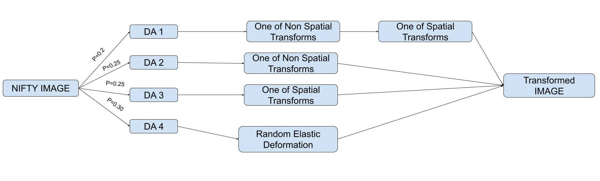
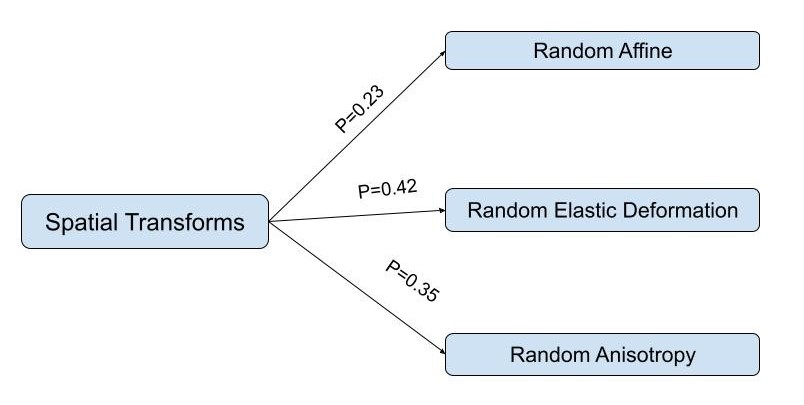
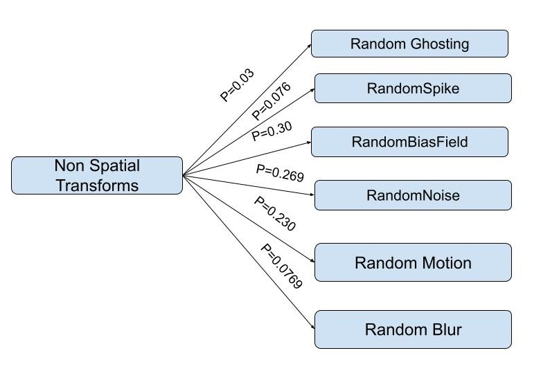

# Project:  Data Augmentation of 3D Medical Images and Landmarks

##### System requirements #####

* windows/linux
* Python 3.6 or above
* Pytorch>=1.1
* torchio==0.18.30

##### Dependencies ######

* nibabel==3.2.1
* tqdm==4.60.0
* numpy==1.20.1
* torchio==0.18.30
* SimpleITK==2.0.2

##### Installation #######

* Install the required libraries using `pip install -r requirements.txt`

##### Info #######
 
*      Policy distribution if `--policy=all` is used 

There are five types of augmentation available in the project:
Policy  | Description
------------- | -------------
DA-1  | One of Spatial Transforms and then one of Non Spatial Transforms
DA-2  | One of Non Spatial Transforms
DA-3  |One of Spatial Transforms
DA-4 | Random Elastic deformation
DA-5 | Scaling, Rotation, Translation
ALL | Run all the DA1,DA2,DA3,DA4 with the above given distribution 

	1. DA-1: One of Spatial Transforms and then one of Non Spatial Transforms
	2. DA-2: One of Non Spatial Transforms
	3. DA-3: One of Spatial Transforms
	4. DA-4: Random Elastic deformation
	5. DA-5 : Scaling, Rotation, Translation
	6. ALL: Run all the DA1,DA2,DA3,DA4 with the above given distribution 

Operations available in Spatial/Non Spatial Transforms are :

	1. Spatial Transforms : RandomAffine(Translation, Rotataion, Scaling), RandomAnisotropy, RandomElasticDeformation
	2. Non Spatial Transforms: RandomGhosting, RandomSpike, RandomBiasField, RandomNoise, RandomMotion, RandomBlur

> Note: A particular transformation operation is selected according to the weights assigned given in the flow chart

*      Spatial transforms distribution     

*      Non Spatial transforms distribution

##### Run #######

   `python TOrchIO+SITK_transforms.py --nifty_input_path <input path of nifty> --fcsv_input_path <input path to the landmarks file in .fcsv> --output_path<output path> --policy <policy no>`

##### Examples #######

1. Performs DA1-4 with the associated policies  -----> set `--policy=all`
2. Perform a given Data augmentation policy  -----> set `--policy=<policy no>`
3. To perform data augemntation using the SITK module(for rotation,translation,scaling)  -----> set `--policy=5`

##### Create your own policies ##### 
To create your own policies read this [TorchIO documentation](https://torchio.readthedocs.io/transforms/augmentation.html)
and modify the `Policy()` class in `TOrchIO+SITK_transforms.py`

